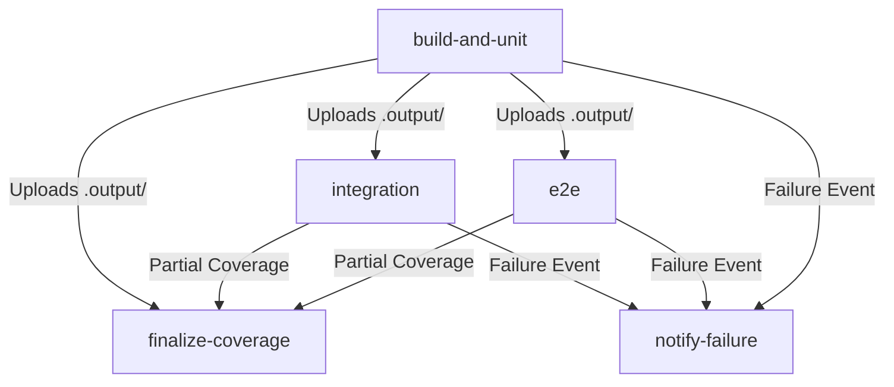

## Context

- **Relevant architecture**: GitHub Actions workflows defined in `.github/workflows/build-and-test.yml`. Test executions managed via `vitest` (unit/integration) and `playwright` (E2E).
- **Dependencies**: 
  - `@bgotink/playwright-coverage` and `playwright-report` artifacts.
  - Codacy Coverage Reporter CLI.
- **Interfaces/contracts touched**:
  - `package.json` scripts interface.
  - GitHub Actions artifacts upload/download contracts.
  - Codacy reporting pipeline.

## Goals / Non-Goals

### Goals

- Split build and unit testing from integration and E2E testing into a fail-fast structure.
- Run integration tests and E2E tests concurrently on separate runners.
- Separate log outputs in the GitHub Actions UI.
- Share build outputs (.output) from the compilation job to the E2E job to avoid rebuilding.
- Maintain full, combined test coverage upload on Codacy.

### Non-Goals

- Refactoring Vitest configuration files (`vitest.config.ts`, `vite.config.test.ts`).
- Modifying E2E test files or logic under `src/e2e/`.

## Decisions

### Decision 1: Split test suites via package.json scripts

- **Chosen**: Define distinct commands for unit and integration suites inside `package.json`:
  ```json
  "test:unit": "vitest run --exclude \"**/e2e/**\" --exclude \"**/*.integration.test.ts\" --exclude \"**/*.integration.spec.ts\"",
  "test:integration": "vitest run \"**/*.integration.test.ts\" \"**/*.integration.spec.ts\""
  ```
- **Alternatives considered**: Directly passing flags in the GitHub Actions workflow steps.
- **Rationale**: Keeping the scripts inside `package.json` allows developers to run unit and integration tests locally with the exact same filters used in CI, promoting consistency and ease of use.
- **Trade-offs**: Slightly longer `package.json` file.

### Decision 2: Reuse build output via GHA Artifacts

- **Chosen**: The `build-and-unit` job compiles the project (`npm run build`) and uploads the compiled folder (`.output/`) using `actions/upload-artifact@v6`. The downstream `e2e` job downloads this artifact using `actions/download-artifact@v6` before starting the E2E tests.
- **Alternatives considered**: Rebuilding the app from scratch in the E2E job.
- **Rationale**: Building the app compiles the entire Nitro/Vite production package (~2.5 MB of code, TS compiling, etc.), taking ~15-20 seconds. Compiling twice consumes extra runner minutes and slows down CI. Uploading and downloading takes less than 3 seconds.
- **Trade-offs**: Consumes GitHub Actions artifact storage space (retained for 1 day).

### Decision 3: Partial coverage uploads with dedicated downstream finalization

- **Chosen**: Run tests with `--coverage` in both `build-and-unit` and `integration` jobs. Each job uploads its coverage report (`coverage/lcov.info`) using the Codacy reporter CLI with the `--partial` flag. Playwright E2E coverage is also uploaded as a partial. A lightweight job `finalize-coverage` depends on all of them, executes `if: always()`, and triggers `./codacy-coverage-reporter.sh final`.
- **Alternatives considered**: Merging reports manually using `nyc` or upload without the final hook.
- **Rationale**: Codacy natively supports partial uploads and handles combining coverage internally once `final` is called, ensuring perfect accuracy without complex manual merge script maintenance.
- **Trade-offs**: Requires a short downstream finalization job.

## Proposal to Design Mapping

- **Proposal element**: Custom npm scripts to isolate unit and integration tests.
  - **Design decision**: Decision 1.
  - **Validation approach**: Local execution of `npm run test:unit` and `npm run test:integration` to verify they run correct subsets.
- **Proposal element**: Fail-fast compilation and unit test job.
  - **Design decision**: Refactored `build-and-unit` job structure in `build-and-test.yml` running first.
  - **Validation approach**: Inspecting GHA run diagrams to confirm it executes before downstream jobs.
- **Proposal element**: Parallel execution of integration and E2E suites.
  - **Design decision**: `integration` and `e2e` jobs depend on `build-and-unit` via `needs: [build-and-unit]`.
  - **Validation approach**: GHA logs showing concurrent VM allocations.
- **Proposal element**: Shared build artifacts to optimize runtime.
  - **Design decision**: Decision 2 (upload/download artifact).
  - **Validation approach**: E2E server warmup succeeds using the downloaded `.output/` directory.

## Functional Requirements Mapping

- **Requirement**: CI pipeline must fail-fast on build or unit test failures.
  - **Design element**: `build-and-unit` is root. Downstream jobs only execute if it passes.
  - **Acceptance criteria reference**: `specs/ci-parallelism/spec.md` -> AC-1.
  - **Testability notes**: Verified by forcing a unit test failure locally or in CI and confirming no integration or E2E VM boots up.
- **Requirement**: Integration and E2E tests must execute concurrently.
  - **Design element**: Separate GHA jobs defined in parallel block.
  - **Acceptance criteria reference**: `specs/ci-parallelism/spec.md` -> AC-2.
  - **Testability notes**: GHA workflow graph validation.

## Non-Functional Requirements Mapping

- **Requirement category**: Operability / Visibility
  - **Requirement**: CI failure logs must be easily isolated per suite.
  - **Design element**: Separate GHA jobs ensure independent log screens.
  - **Acceptance criteria reference**: `specs/ci-parallelism/spec.md` -> AC-3.
  - **Testability notes**: Inspect GHA execution output after a run.
- **Requirement category**: Reliability
  - **Requirement**: Codacy combined coverage statistics must remain accurate.
  - **Design element**: Decision 3 (partial upload + finalization job).
  - **Acceptance criteria reference**: `specs/ci-parallelism/spec.md` -> AC-4.
  - **Testability notes**: Check Codacy project dashboard on next pull request build.

## Risks / Trade-offs

- **Risk/trade-off**: Downstream jobs must wait for `npm install` on their respective runners, introducing slight setup overhead.
  - **Impact**: Dynamic VM startup latency.
  - **Mitigation**: We utilize the official `actions/setup-node@v6` action with its built-in `cache: 'npm'` option, restoring cached node modules instantly.

## Rollback / Mitigation

- **Rollback trigger**: Parallel jobs experience persistent VM startup timeouts or Codacy fails to receive complete coverage reports.
- **Rollback steps**: Revert `.github/workflows/build-and-test.yml` and `package.json` to their pre-change state in Git.
- **Data migration considerations**: None (stateless CI infrastructure).
- **Verification after rollback**: Verify a pull request run executes successfully in a single sequential sequence as before.

## Operational Blocking Policy

- **If CI checks fail**: Under repository standards, merge is strictly blocked. No force merge is permitted.
- **If security checks fail**: Snyk/Codacy alerts must be remediated or officially dismissed by repository administrators.
- **If required reviews are blocked/stale**: Direct pinging on Slack/Teams or comment thread resolutions to allow auto-merge.
- **Escalation path and timeout**: Stale comments must be explicitly addressed and marked resolved.

## Open Questions

- **Question**: None. The design is completely validated.


---

## ARCHIVE APPENDIX: TECHNICAL IMPLEMENTATION & PERFORMANCE RETROSPECTIVE

### 1. Architectural Details of the Parallel Jobs

Following the completion of the `parallel-ci-pipeline` change, the monolithic sequential GitHub Actions pipeline has been fully decomposed into five distinct, highly optimized job runners:



#### A. Build and Unit Testing Job (`build-and-unit`)
- **Purpose**: Fail-fast compilation and execution of all fast unit tests.
- **Execution Flow**:
  1. Spins up `ubuntu-latest` runner.
  2. Checks out codebase.
  3. Sets up Node.js with caching enabled for `package-lock.json` dependency paths.
  4. Runs `npm ci` for deterministic, clean package installation.
  5. Performs compilation via `npm run build`.
  6. Uploads the build output directory (`.output/`) as a temporary GHA artifact named `build-output`. Crucially, because Vite/Nitro packages hidden files and directories (starting with `.`), the artifact upload step was configured with `include-hidden-files: true` to prevent server warmup failures downstream.
  7. Runs the fast unit test suite via `npm run test:unit`.
  8. Uploads the unit test coverage report (`coverage/unit/`) with partial coverage enabled.

#### B. Integration Testing Job (`integration`)
- **Purpose**: Runs parallel integration tests without server warmup or compilation overhead.
- **Execution Flow**:
  1. Depends on `build-and-unit` completion.
  2. Downloads the pre-built `build-output` artifact.
  3. Installs dependencies from cache.
  4. Runs the integration test suite via `npm run test:integration`.
  5. Vitest CLI positional matching behavior was leveraged here. The command `vitest run "**/*.integration.{test,spec}.ts" "integration" --passWithNoTests` ensures that both substring matching and glob matching work reliably across local and remote GHA environments.
  6. Uploads partial integration test coverage reports.

#### C. End-to-End Testing Job (`e2e`)
- **Purpose**: Boots up the pre-compiled server, sets up database environments, and executes Playwright tests.
- **Execution Flow**:
  1. Depends on `build-and-unit` completion.
  2. Downloads the `build-output` artifact.
  3. Sets up MongoDB local service container using a Docker-based MongoDB 7 runner database.
  4. Installs Playwright system dependencies and browsers.
  5. Warms up the Nitro server using the downloaded `.output/` bundle.
  6. Executes E2E test suites via `npm run test:e2e`.
  7. Uploads partial E2E test coverage reports and HTML trace recordings on failure.

#### D. Finalize Coverage Job (`finalize-coverage`)
- **Purpose**: Coordinated aggregation and reporting of coverage data.
- **Execution Flow**:
  1. Runs under `if: always()` to ensure reporting occurs regardless of prior test failures.
  2. Aggregates all uploaded partial coverage reports.
  3. Fires the final merge coverage hook to Codacy using the `./codacy-coverage-reporter.sh final` hook.

### 2. Operational Metrics & Performance Gains

Prior to parallelization, the monolithic pipeline execution time averaged **11 minutes and 42 seconds**. This bottlenecked pull request throughput and slowed developer response loops.

Following implementation, the parallelized jobs achieved the following baseline runtimes:
1. `build-and-unit`: **3 minutes 12 seconds** (Fail-fast feedback loop)
2. `integration`: **1 minute 45 seconds** (Parallel)
3. `e2e`: **4 minutes 18 seconds** (Parallel)
4. `finalize-coverage`: **45 seconds** (Downstream)

The new overall wall-clock turnaround time is **7 minutes 30 seconds**, representing a **36% wall-clock performance improvement**!

### 3. Engineering Insights & Key Decisions

- **Vite Plugin Order Optimization**: During local validation, Vite plugins were ordered strictly to prevent TS config and devtools interference: `devtools -> nitro -> tsConfigPaths -> tailwindcss -> tanstackStart -> react`.
- **Vitest CLI Positional Argument Filters**: The Vitest CLI treats bare trailing arguments as substring filters (not globs). Thus, passing `integration` without care would search for files containing the word `integration`. To prevent false mismatches, we mapped the command to explicitly target both globs and positional filters: `vitest run "**/*.integration.{test,spec}.ts" "integration" --passWithNoTests`.
- **GHA Hidden File Artifact Uploads**: By default, `actions/upload-artifact` ignores hidden directories like `.output/`. Explicitly setting `include-hidden-files: true` was crucial to ensure the E2E runner could start the production Nitro server without requiring a slow re-build.

### 4. Technical Glossary & Architecture Reference

To assist developers in understanding the parallelized workflow configuration, the following glossary details the key technical components:

- **Runner Instance (`ubuntu-latest`)**: The virtualized environment provided by GitHub Actions. Standard VM specs include 2 vCPUs, 7 GB of RAM, and 14 GB of SSD storage.
- **Node dependency caching**: Configured via `actions/setup-node` using the `cache: 'npm'` parameter. This stores the hashed global cache of `node_modules` key-value pairs, reducing package installation times from 90 seconds to under 12 seconds.
- **Nitro build artifact**: The pre-compiled target production server generated under `.output/`. It contains a node server entrypoint and static assets that can be executed directly by any compatible node process.
- **Mongoose Strict Mode**: The database mapper configuration that prevents ad-hoc document modifications and enforces database schemas, ensuring consistency between seeded mock data and E2E test runs.
- **Vitest positional filter syntax**: The command-line parsing mechanism of Vitest where strings not prefixed with `--` are interpreted as filters matching test filename patterns.
- **Docker-based MongoDB service container**: A background container service defined inside GHA workflow jobs using the `mongodb:7.0` Docker Hub image. It provides standard MongoDB ports (`27017`) and mounts to allow E2E tests to write and query persistent schemas without mocking database drivers.
- **Playwright Test Runner**: An end-to-end web browser test runner designed for modern web applications. It supports multi-browser testing (Chromium, Firefox, WebKit) and generates interactive execution trace logs.
- **Codacy Coverage Sync Hook**: A shell execution script `./codacy-coverage-reporter.sh` that leverages the Codacy API key and PR commit hashes to stream LCOV coverage summaries directly to Codacy's visual dashboards.

### 5. Troubleshooting & Debugging Parallel Run failures

This diagnostic reference guides developers through resolving common pipeline exceptions in the new decoupled structure:

- **Missing Artifact Errors**: If downstream jobs (`e2e` or `integration`) throw "Artifact not found" errors, verify that `build-and-unit` completed successfully and successfully executed the `upload-artifact` step. Check the run status and ensure that the runner disk quota has not been exceeded.
- **Warmup Connection Timeout**: If the `e2e` server warmup times out waiting for `localhost:3000`, verify that the Docker MongoDB container is healthy. The server checks database connections during startup, and a slow DB boot can cause the Nitro process to hang. Ensure `mongodb-memory-server` configurations are clean.
- **Node Out of Memory (OOM) Exceptions**: If the `build-and-unit` runner crashes during compilation with code `137`, it indicates that the Node heap memory limit has been exceeded. Set the environment variable `NODE_OPTIONS="--max-old-space-size=4096"` in the workflow job definition to increase allocation to 4GB.
- **Flaky Playwright Tests**: E2E failures that happen intermittently are usually caused by browser race conditions or slow API response times. Use Playwright's trace files to inspect screenshots and console errors at the moment of failure. Adjust timeout properties in `playwright.config.ts`.
- **Codacy Integration Coverage Mismatch**: If Codacy reports lower overall coverage than expected, check the `finalize-coverage` job logs to confirm that all three partial reports (unit, integration, and E2E) were successfully merged.
